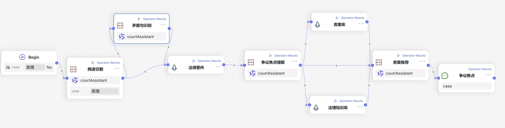

# CourtAssistant
AI类案推荐助手


## 项目概述
本项目旨在搭建一个高效且易于部署的争议焦点提取和类案推荐大模型。团队在有限的资源和时间下，设计并实现了这一智能助手系统，能帮助法官和法律从业者更高效地处理民商事裁判文书，提高案件审理的效率与准确性。

## 项目背景
在司法审判中，争议焦点的提取和类案的推荐是判决依据的重要组成部分。为了在海量裁判文书中快速、精准地提取争议焦点，并根据案件特点推荐相关案例，本团队通过大模型和自然语言处理技术，构建了一个智能系统。

## 关键技术与架构

### 1. 裁判文书搜集平台
团队首先搭建了一个裁判文书搜集平台，利用Flask框架建立了一个网页平台，发动团队成员高效地收集了约2000份民商事裁判文书。这些数据为后续的模型训练和测试提供了基础。

### 2. 数据处理与模型调用
在数据处理方面，我们结合数据安全需求，通过本地部署的**DeepSeek**和**Qwen**模型（使用ollama）来处理敏感数据，同时调用豆包和Qwen API进行普通任务处理。裁判文书在预处理阶段，经过分类标注、敏感数据去除等步骤，为后续模型的应用做好准备。

### 3. 争议焦点提取
我们使用了本地部署的**deepseek-r1:8b**模型对裁判文书进行分类标注，并借助LCS（最长公共子序列）方法进行检验，以提高标注精度。针对争议焦点提取，我们通过LoRA微调了Qwen2.5:7b基底模型，设计了专门的提示词，确保能够精确地提取争议焦点，进一步减少计算成本并提升准确性，模型发布在<link>https://huggingface.co/zcl123/CourtAssistant</link>。

### 4. 诉讼两造切割、矛盾句分析与法律要件提取
在微调模型的基础上，我们实现了一个包含**诉讼两造切割、矛盾句分析及法律要件提取**的思维链。这一设计显著提升了争议焦点的提取准确率，同时能够高效地识别案件中的关键法律要素，帮助法官在案件审理中更快速地把握核心问题。

### 5. 类案推荐系统
在类案推荐方面，我们基于**RAG(Retrieval-Augmented Generation)**构建了一个类案推荐系统，能够从外部知识库中检索信息并结合法理知识库和类案库提供精准推荐。法理知识库包括法律条文体系、司法解释库以及法学理论库，而类案库则严格筛选、标注案例，并实时更新。通过这一系统，法官可以快速获取与当前案件相关的判例，从而提升审判效率。

## 系统架构
本系统的架构主要由以下几个模块组成：

- **裁判文书搜集平台**：Flask Web平台，支持文书上传、管理与查询。
- **数据处理模块**：基于大模型API和本地部署模型进行敏感数据处理和常规任务处理。
- **争议焦点提取模块**：微调后的Qwen模型，用于精确提取争议焦点并降低计算成本。
- **类案推荐模块**：基于RAG和法理知识库进行类案推荐，提供实时更新的类案数据。
  
## 部署与使用

1. 克隆本仓库：
   ```bash
   git clone https://github.com/yourusername/CourtAssistant.git
   ```

2. 部署 CourtAssistant
   ```bash
   git lfs install
   git clone https://huggingface.co/zcl123/CourtAssistant
   ```

   执行以下命令来创建 CourtAssistant：

   ```bash
   ollama create <path-to-CourtAssistant> courtAssistant
   ```

   可以通过以下命令查看部署情况：

   ```bash
   ollama list
   ```

   在系统环境变量中，添加：

   ```bash
   OLLAMA_HOST=6399  # 默认为 11434
   ```

   然后运行：

   ```bash
   ollama serve
   ```

3. API 调用

   ```bash
   python models.cot.py --model courtAssistant:latest --case "你的案情"
   ```

4. RAG&Agent

   可在RAGFlow中实现，对外接口目前在开发中

   
   

| 作者   | 联系方式              |
|:--------:|:----------------------:|
| ZCL  | 202320037@uibe.edu.cn |
| LY  | -  |
| YST  | -  |
| YRH  | -  |
| RWY  | -  |
| LL  | -  |
| GXY  | -  |
| ZJY  | -  |
Copyright UIBE 法学院 信息学院 国际商学院
